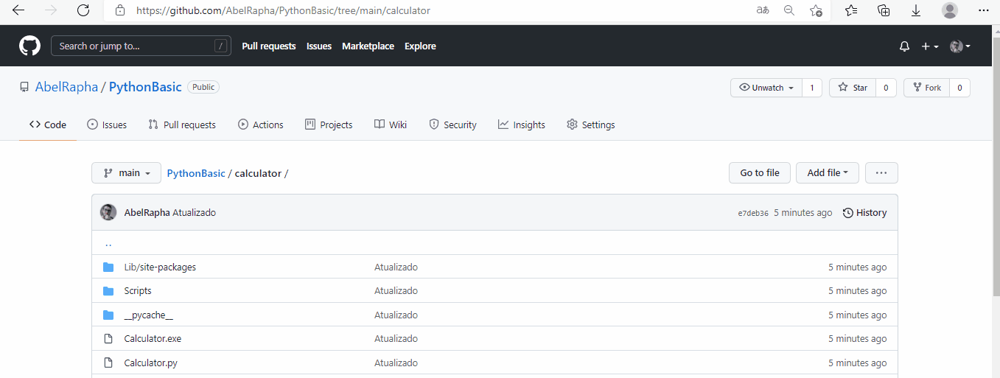

# Calculadora
* Neste projeto realizei a construção de uma calculadora por meio da biblioteca Tkinter.

* Além disso gerei um arquivo executável para que qualquer desktop consiga utilizá-lo por meio do Pyinstaller 

## Para utilizar
1. Basta dar um clique no arquivo __calculator.exe__ e depois ir na opção de download.
2. Depois é só começar a fazer suas continhas do dia a dia hahaha

### Autoria
* Criado por [mim](github.com/AbelRapha) ♥.
* Linkedin: [clique aqui](https://www.linkedin.com/in/abel-rapha-280a0a216/)   
* E-mail: contato@abelrapha.com
* Ideia do Projeto [Usando Python](https://www.youtube.com/watch?v=i24MxljM-Bw&t=160s)